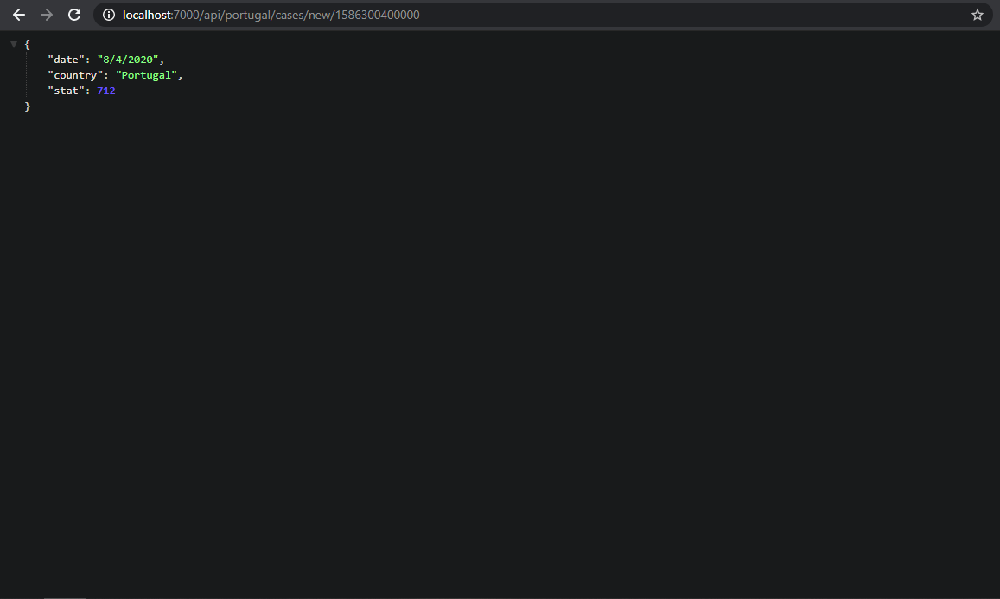
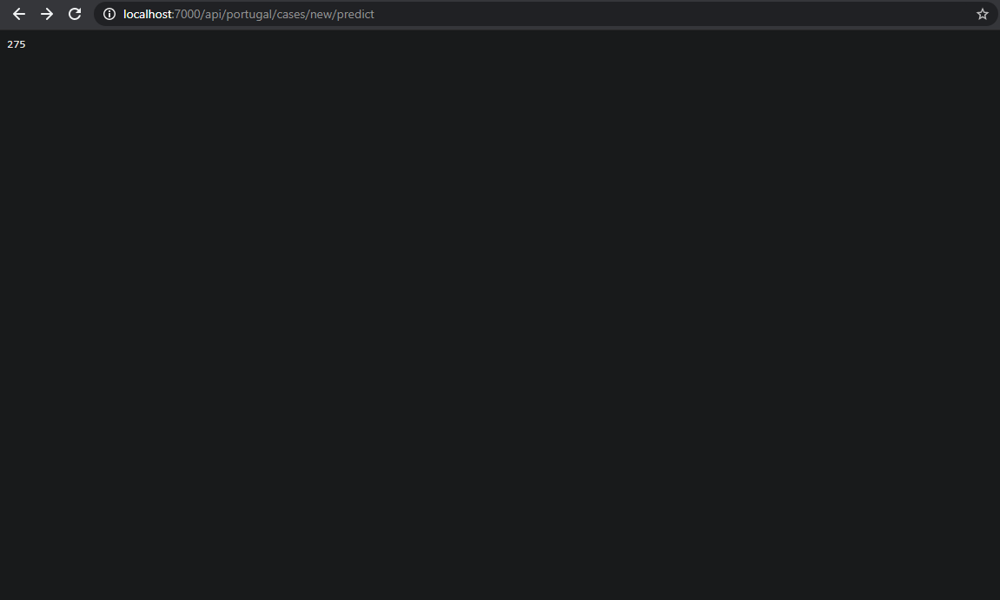
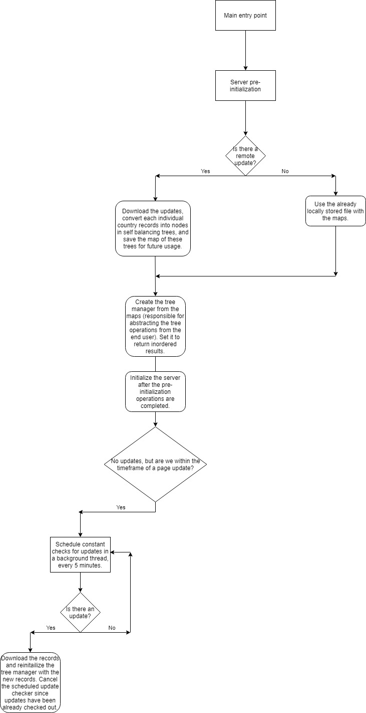

# COVID-19 Tracker

A simple COVID-19 tracker that makes use of self-balancing trees to store the various COVID-19 statistics and exposes them through a REST API. This project is part of the Linguagens de Programação course unit evaluation.

Developers: Me.

List of endpoints:

**NOTE:** The ":country" string represents a path parameter, same as ":date".

`/api/:country/cases/new`: New cases of Coronavirus in X country since Y date (the date where the cases were first accounted for.)

`/api/:country/cases/total`: Total cases of Coronavirus in X country since Y date.

`/api/:country/deaths/new`: New deaths of Coronavirus in X country since Y date.

`/api/:country/deaths/total`: Total deaths of Coronavirus in X country since Y date.

`/api/:country/cases/new/:date`: New cases of Coronavirus in X country in the Y date.

`/api/:country/cases/total/:date`: Total cases of Coronavirus in X country in the Y date.

`/api/:country/deaths/new/:date`: New deaths of Coronavirus in X country in the Y date.

`/api/:country/deaths/total/:date`: Total deaths of Coronavirus in X country in the Y date.

`/api/:country/cases/new/predict`: Predicts the new Coronavirus cases in X country for the next day using a simple Linear Regression model. **IMPORTANT NOTE:** This Linear Regression model doesn't take into account external variables and only works by making predictions based on the trend of the latest 15 days!

`/api/:country/cases/total/predict`: Predicts the total Coronavirus cases in X country for the next day.

`/api/:country/deaths/new/predict`: Predicts the new Coronavirus deaths in X country for the next day.

`/api/:country/deaths/total/predict`: Predicts the total Coronavirus deaths in X country for the next day.

**EXAMPLES**

* New cases since X date.

* New cases in X date.

* Predicting the number of new cases for the next day.

Fluxogram of the Main class general operation when first ran:

